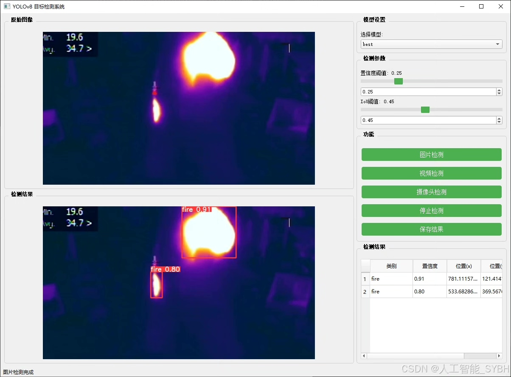
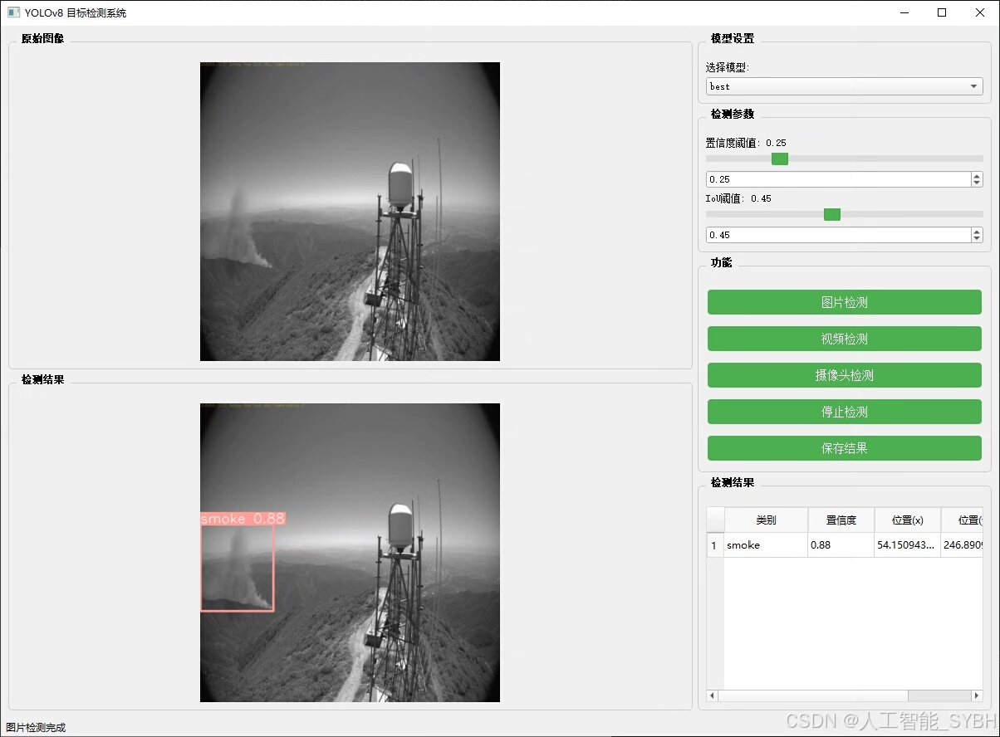
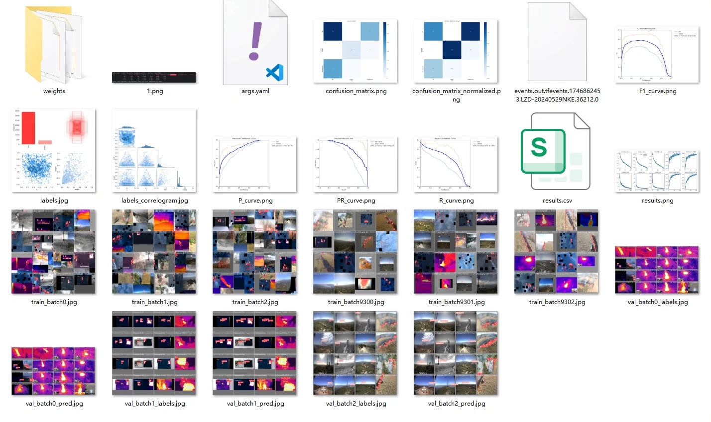
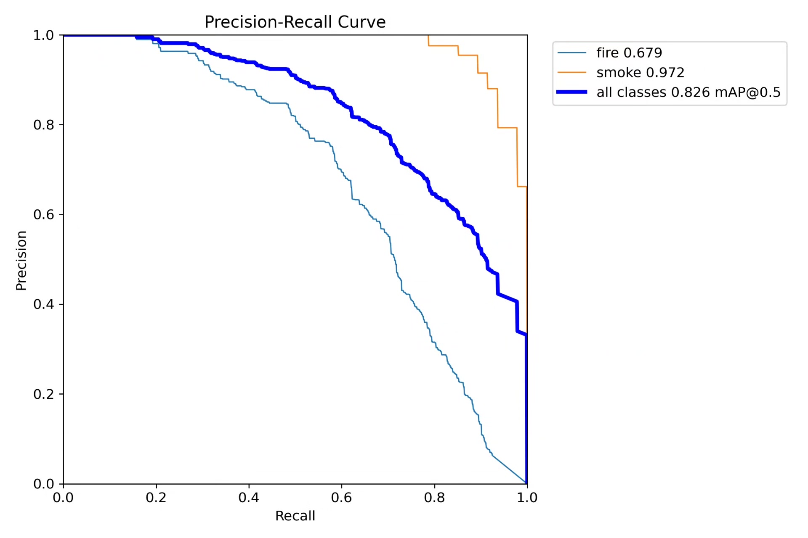
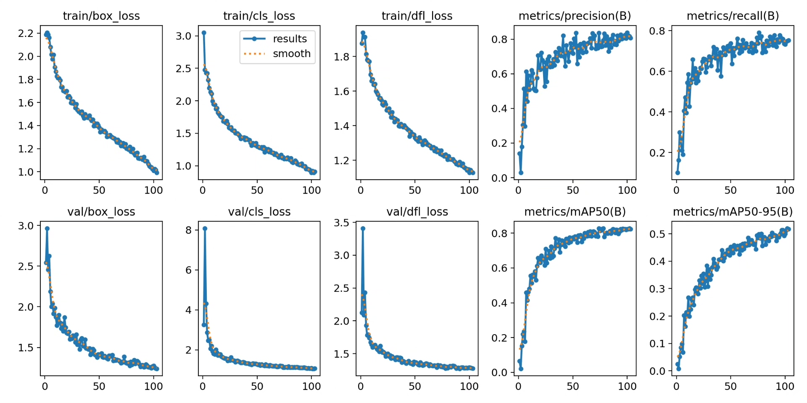
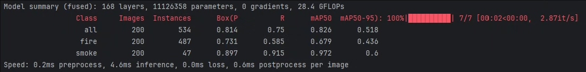
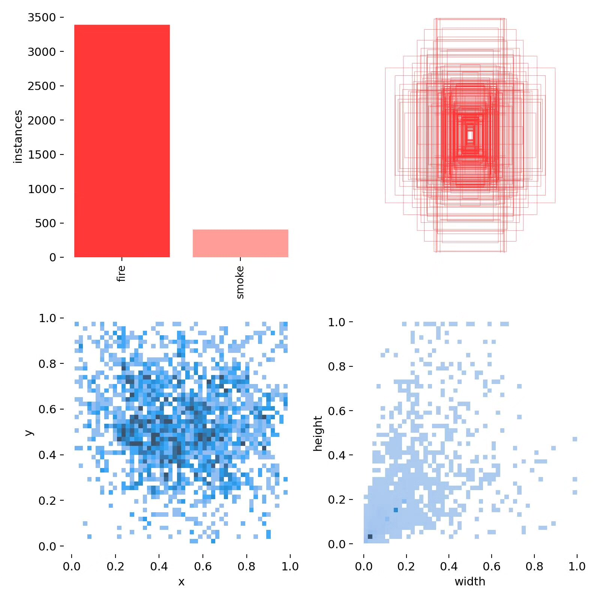
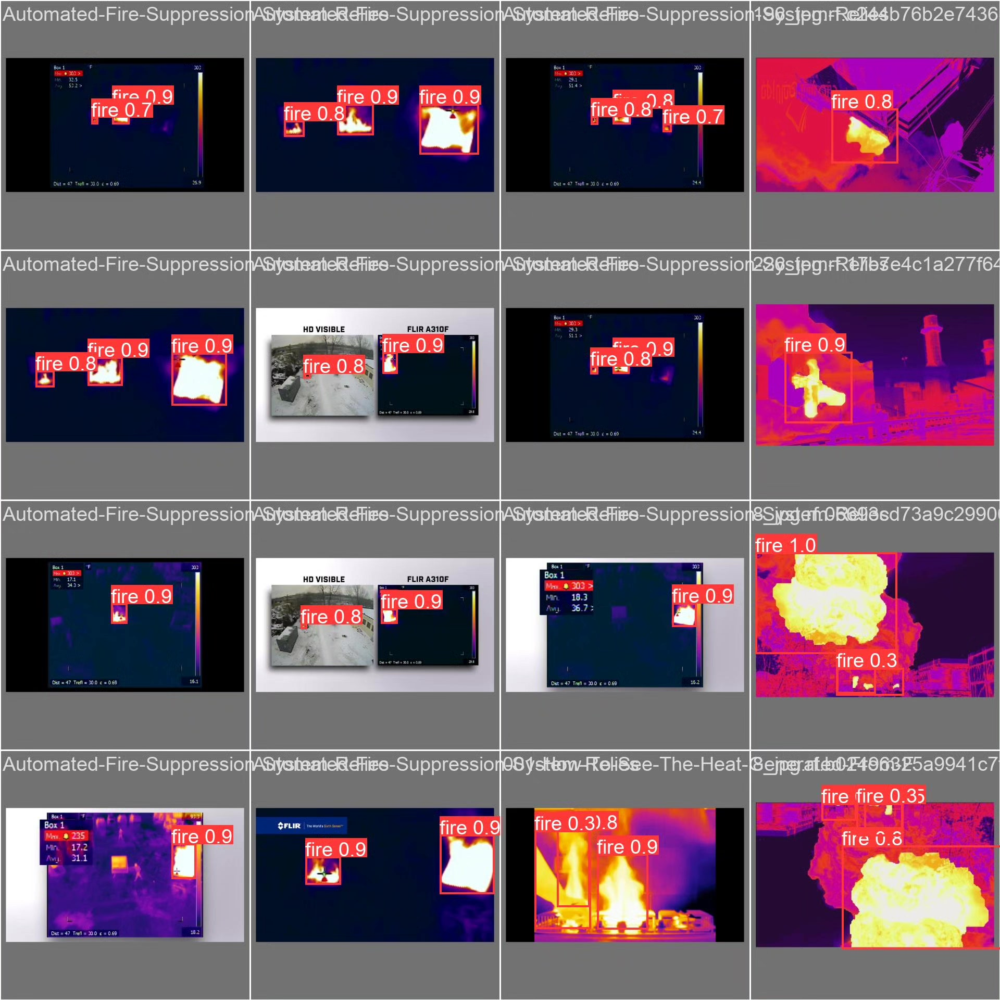

# Based on deep learning YOLOv8 for forest fire smoke and infrared detection system (YOLO)

## Body

Based on the advanced YOLOv8 object detection algorithm, this project has developed a forest fire smoke detection system for early warning. The system adopts a dual-category detection framework (nc=2), capable of accurately identifying "fire" (flames) and "smoke" (smoke) as two key targets. The project has built a professional dataset containing 2000 infrared images, including 1600 training sets, 200 validation sets, and 200 test sets, ensuring the sufficient training and reliability of model evaluation. Through processing real-time image streams captured by infrared cameras, the system can achieve 24-hour all-weather monitoring in forest areas, detecting fire sources and smoke signs at the early stages of fire, providing an efficient and precise intelligent solution for forest fire prevention. Experimental results show that the system achieves high detection accuracy and real-time performance on the test set, meeting the real-time requirements of forest fire monitoring.

The company's products have obtained YOLO official commercial license certification.

We provide after-sales service.

After payment, we will provide WeChat ID to answer questions anytime.

Environment configuration: We will provide a tutorial on environment configuration, and WeChat will provide answers.

Remote installation service: If you need remote configuration, an additional fee of 69 is required, with all fees refunded if the configuration fails (only refund installation fees for older computers).

Retraining dataset: After setting up the environment, you can train on your own computer. If you need us to retrain, just pay 69 plus computing power fees (2.5 yuan/hour).

Full after-sales service

## Images

## Payment

Here is a pay link on Stripe ( https://buy.stripe.com/3cs8yP7sY87d0vu9AB ). Please contact me lonlonago@foxmail.com after funding $89, and I will send you a complete data files , thank you!

